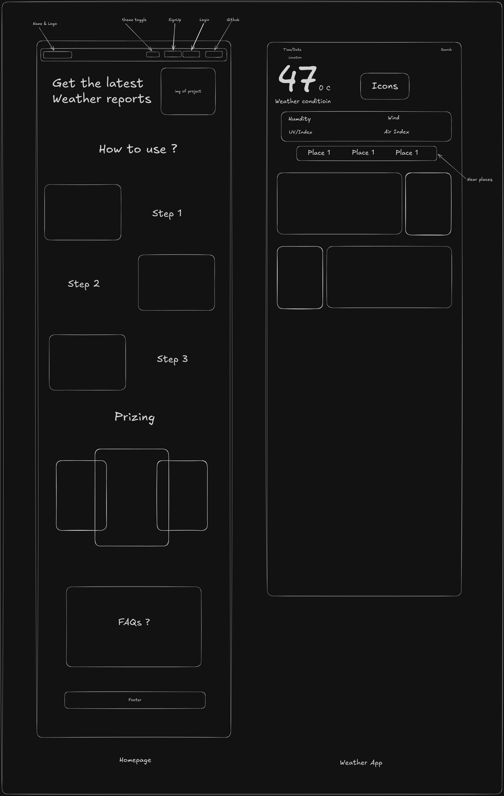

# Future Plan for this project

- [ ] Make a SVGs of morning and night based on the theme change.
- [ ] Add Github Stares and Github logos header.
- [ ] Add RESTFULL Apis for showing apis of the application like
  - [ ] /info <-- gives general info about weather.
  - [ ] /current <-- gives current status of the weather.
  - [ ] /post <-- gives past data.
- [ ] Make a dashboard that shows 7 days of data.
- [ ] Add login/signup page to show the dashboard.
- [ ] Sends the email to user about the important weather.
- [ ] Add if integration with the google calender.

---
